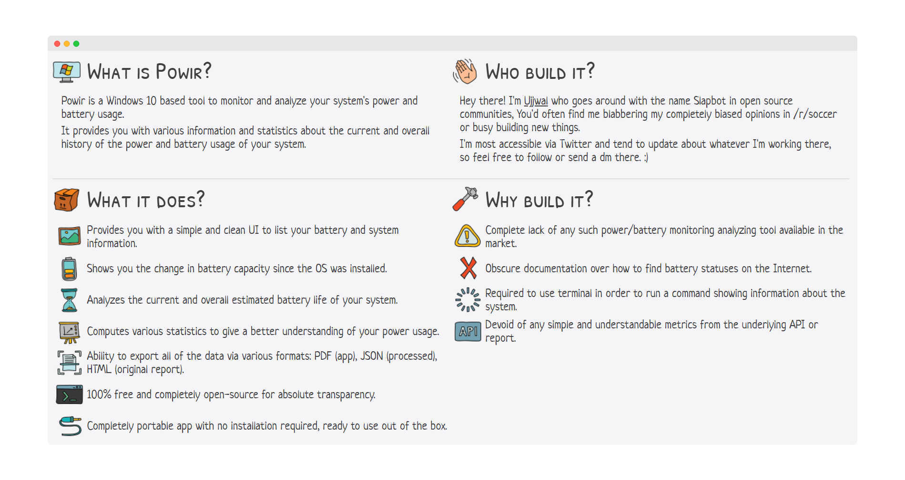
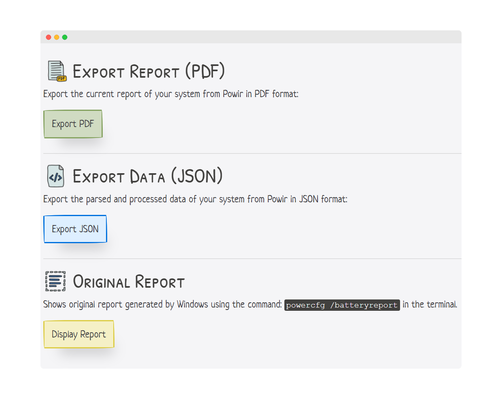
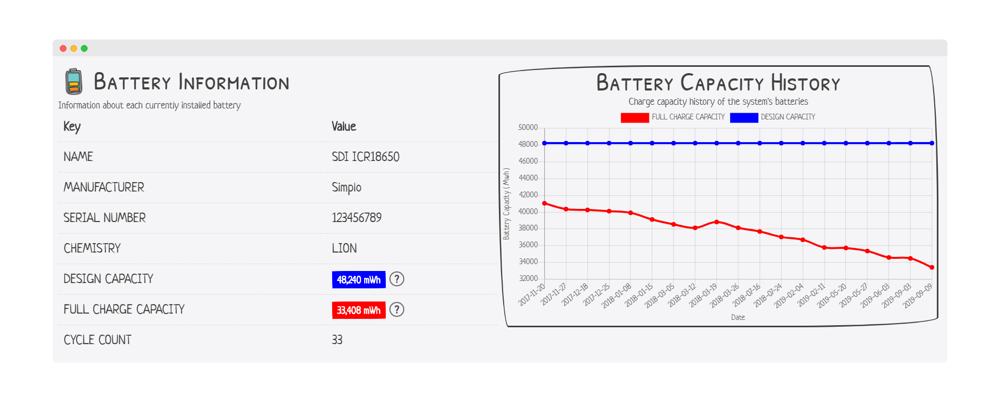
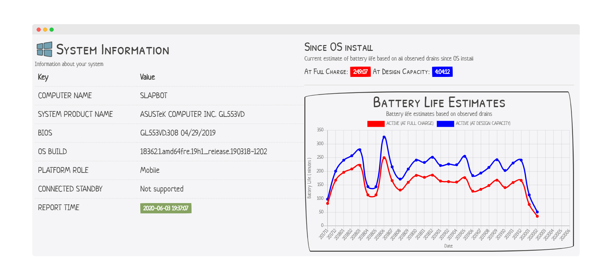
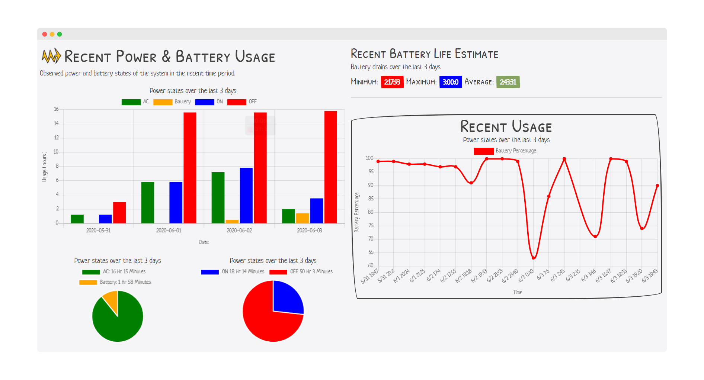
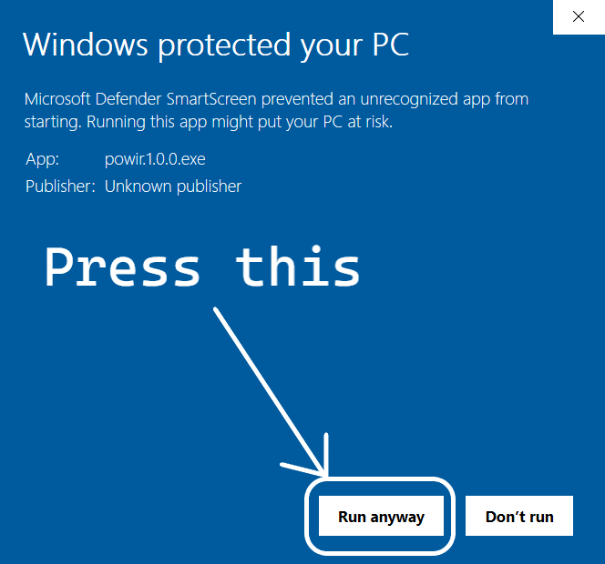
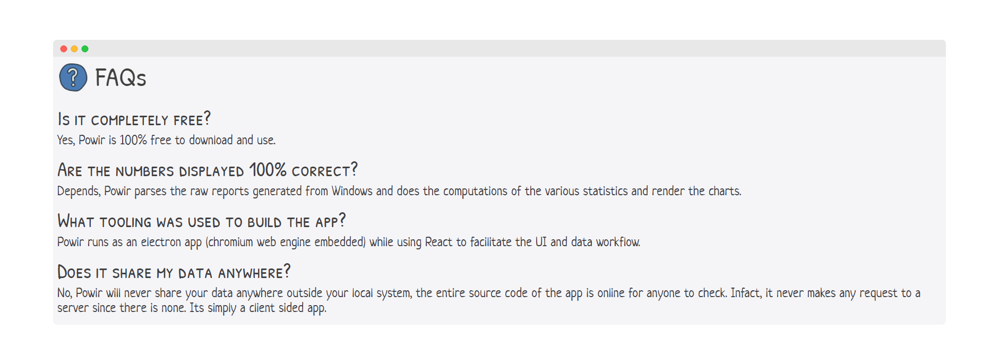

<br />
<p align="center">
  <a href="https://powir.slapbot.me">
    
  </a>
  <h3 align="center">Powir</h3>
  <p align="center">
    Windows 10 based tool to monitor and analyze your system's power and battery usage
    <br />
    <a href="https://powir.slapbot.me"><strong>Explore the website »</strong></a>
    <br />
    <br />
    <a href="https://join.slack.com/t/slapbotworkspace/shared_invite/zt-f1ywjyyq-6NT2jF23jjw5fS8oY5gAsQ">Join Slack</a>
    ·
    <a href="https://github.com/slapbot/powir/issues">Report Bug</a>
    ·
    <a href="https://github.com/slapbot/powir/issues">Request Feature</a>
    ·
    <a href="https://twitter.com/ugupta41">Give Feedback</a>
  </p>
</p>

<hr>


<!-- TABLE OF CONTENTS -->
## Table of Contents

* [About the Project](#about-the-project)
  * [What is it?](#what-is-it)
  * [Installation](#installation)
* [Features](#features)
  * [What it does?](#what-it-does)
  * [Why build it?](#why-build-it)
  * [Actions?](#actions)
* [Gallery](#gallery)
  * [Battery Information](#battery-information)
  * [System Information](#system-information)
  * [Power And Battery Usage](#power-and-battery-usage)
* [Installation Methods](#installation-methods)
  * [Desktop App (Main Mode)](#desktop-app-main-mode)
    * [Browser And Windows Defender Warnings](#browser-and-windows-defender-warnings)
    * [Solution](#solution)  
  * [Browser Window (Lite Mode)](#browser-window-lite-mode)
* [FAQs](#faqs)
* [Developer](#developer)
  * [Prerequisites](#prerequisites)
  * [Setup](#setup)
  * [Build](#build)
  * [Usage](#usage)
* [Contributing](#contributing)
* [License](#license)
* [Contact](#contact)
* [Acknowledgement](#acknowledgement)

<hr>

## About The Project

### What is it?

Powir is a Windows 10 based tool to monitor and analyze your system's power and battery usage.

It provides you with various information and statistics about the current and overall history of the power and battery usage of your system.

### Installation

There are two ways to install powir:

- [Desktop App (Main Mode)](#desktop-app-main-mode): Installation is as quick as simply downloading the executable and running it.
The App is completely portable meaning you don't have to go through an installation wizard, 
and it can be copied from system to system seamlessly without any dependencies or extra files needed. **Recommended**
  - Terminal: Simply download the binary and run it:
  ```bash
  curl -L https://github.com/SlapBot/powir/releases/download/v1.0.4/powir.1.0.4.exe --output powir.exe
  ./powir
  ```
  - Double Click: Again [download](#desktop-app-main-mode) the binary and run it but please read this [note](#browser-and-windows-defender-warnings)

- [Browser Window (Lite Mode)](#browser-window-lite-mode): Installation requires few pre-requisites (node & npm) and firing a command from the command prompt which opens up a tab in your default browser serving file via a local server. Actions (Export PDF, JSON) are missing in the lite mode.

## Features


### What it does?
- Provides you with a simple and clean UI to list your battery and system information.
- Shows you the change in battery capacity since the OS was installed.
- Analyzes the current and overall estimated battery life of your system.
- Computes various statistics to give a better understanding of your power usage.
- Ability to export all the data via various formats: PDF (app), JSON (processed), HTML (original report).
- 100% free and completely open-source for an absolute transparency.
- Completely portable app with no installation required, ready to use out of the box.


### Why build it?
- Complete lack of any such power/battery monitoring analyzing tool available in the market.
- Obscure documentation over how to find battery statuses on the Internet.
- Required to use terminal in order to run a command showing information about the system.
- Devoid of any simple and understandable metrics from the underlying API or report.


### Actions



- Export the current report of your system from Powir in PDF format
- Export the parsed and processed data of your system from Powir in JSON format
- Shows original report generated by Windows using the command: `powercfg /batteryreport` in the terminal


## Gallery

### Battery Information




### System Information




### Power And Battery Usage



## Installation Methods

### Desktop App (Main Mode)

- Simply go to [Releases](https://github.com/SlapBot/powir/releases) and pick the latest version to download.
- Download Current Latest Version (Powir v1): [Github](https://github.com/SlapBot/powir/releases/latest/download/powir.1.0.4.exe) or [GDrive](https://drive.google.com/drive/folders/1ntEjEenEzZXMP8L_nXNoHnIFqNSLpwD9): **Please take a note below before downloading the app**

#### Browser And Windows Defender Warnings

<strong>Note: </strong>
Since the application isn't code signed yet ([because all of the certificates require annual fee payment regardless of whether you're non-profit or open-source](https://stackoverflow.com/questions/1177552/code-signing-certificate-for-open-source-projects)). Please refer to the issue: [#1](https://github.com/SlapBot/powir/issues/1), Both (Browser & Windows Defender will raise warnings suggesting that app is not protected). 

This doesn't mean that application 
is inherently unsafe <strong>in fact entire source code is open</strong>, and you can build your own distribution following [Build](#build) section but its due to the paperwork and money involved in getting the certificates to sign the applications [which can cost as much as $699 a year or more](https://stackoverflow.com/a/58559506/6303162).

If you are someone who has an experience around self signing certificates with Windows based builds which result in bypassing these warnings, kindly reply in the given thread [#1](https://github.com/SlapBot/powir/issues/1) :)

#### Solution

For now the solution is to simply ignore the warnings as shown below and always download the application from this [repository](https://github.com/SlapBot/powir) only: 




---

### Browser Window (Lite Mode)

Open up the terminal (for non-developers: that is Command Prompt [cmd.exe]) and follow these instructions:

#### Only one time setup

Commands (copy-paste):
```bash
git clone https://github.com/SlapBot/powir.git
cd powir
npm install --production
```

Explanation:
- Ensure you have git, node and npm installed using commands: `git --version`, `node -v` and `npm -v` respectively, else install it from here: [Git](https://git-scm.com/downloads) and [NodeJS](https://nodejs.org/en/download/) (installer contains both node and npm)
- Clone the repository using: `git clone https://github.com/SlapBot/powir.git` and cd into the folder: `cd powir`
- Run `npm install --production` to install dependencies

#### Anytime

Command (copy-paste)
```bash
npm run lite-mode
```

Explanation:
- Now simply run `npm run lite-mode` whenever you want from the directory, and it will open up the dashboard allowing you to monitor and analyze power states.

## FAQs



<strong>Is it completely free?</strong>

Yes, Powir is 100% free to download and use.

<strong>Are the numbers displayed 100% correct?</strong>

Depends, Powir parses the raw reports generated from Windows and does the computations of the various statistics and render the charts.

<strong>What tooling is used to build the app?</strong>

Powir runs as an electron app (chromium web engine embedded) while using React to facilitate the UI and data workflow.

<strong>Does it share my data anywhere?</strong>

No, Powir will never share your data anywhere outside your local system, the entire source code of the app is online for anyone to check. In fact, it never makes any request to a server since there is none. Its simply a client sided app.

<hr>

## Developer
If you're looking to build it from the source or inspect the app, its extremely simply and you only have to follow few instructions as listed below:

### Prerequisites
- Git
- Node
- NPM

### Setup

- Clone the repository: `git clone https://github.com/SlapBot/powir.git`
- Cd into the directory: `cd powir` and run: `npm install`

### Build

- Run `npm run build` which will package the app at `dist/` folder.

### Usage

#### Electron App
- Run these two commands in two separate sessions when you are developing in order to use HMR (hot module reloading):
    - Run react server: `npm run react-start`
    - Run electron app: `npm run electron-start`
- All of the server code is located at: `public/server` directory.
- Entrypoint of the electron app is at`public/electron.js`.
- Everything related to rendering is done at: `src` directory.
- Any of the changes you make at src directory will reflect instantly in the app.
- Any of the changes made for server requires the app to be restarted using: `npm run electron-start`

#### Browser Window App
- Run `npm run lite-mode` which opens up a tab in your default browser again with HMR enabled.
- Entrypoint of the browser window app is at`public/browser.js`.
- Everything related to rendering is done at: `src` directory.
- Any of the changes you make at src directory will reflect instantly in the app.
- Any of the changes made for server requires the app to be restarted using: `npm run lite-mode`

## Contributing

Contributions are what make the open source community such an amazing place to be learn, inspire, and create. 
Any contributions you make are **greatly appreciated**.

1. Fork the Project
2. Create your Feature Branch (`git checkout -b feature/AmazingFeature`)
3. Commit your Changes (`git commit -m 'Add some AmazingFeature'`)
4. Push to the Branch (`git push origin feature/AmazingFeature`)
5. Open a Pull Request

Feel free to join our slack chat group to get more help: [Slack](https://join.slack.com/t/powir/shared_invite/zt-ezy7sf5d-Tt1MmP_bcf_gdGLEJSEfzw)


<!-- LICENSE -->
## License

Distributed under the GPU General Public License. See `LICENSE` for more information.

<!-- CONTACT -->
## Contact

Hey there! I'm [Ujjwal](https://twitter.com/ugupta41) who goes around with the name Slapbot in open source communities, You'd often find me blabbering my completely biased opinions in /r/soccer or busy building new things.

I'm most accessible via Twitter and tend to update about whatever I'm working there, so feel free to follow or send a dm there. :)


## Acknowledgement
Many thanks to these amazing frameworks/libraries/tools/arts without which none of this had been possible! <3

#### Major Libraries
- [ElectronJS](https://www.electronjs.org/)
- [NodeJS](https://nodejs.org/en/)
- [ReactJS](https://reactjs.org/)
- [Tailwind](https://tailwindcss.com/)
- [PaperCSS](https://www.getpapercss.com/)
- [ChartJS](https://www.chartjs.org/)

#### Minor Libraries
- [Lodash](https://lodash.com/)
- [JSSoup](https://github.com/chishui/JSSoup)
- [JSSoup](https://github.com/chishui/JSSoup)

#### Icons
- [Icons8](https://icons8.com/)
